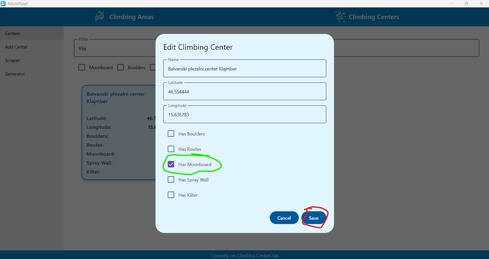

# Primeri uporabe

### 1. Brisanje napačnega ali neprimernega plezališča
**Kaj želi uporabnik narediti:**
* Administrator želi zbrisati napačno ali neprimrno plezališče.

**Koraki izvedbe:**
* Odpre aplikacijo 
* Filtrira po imenu da lahko hitreje najde
* In klikne na rdeč gumb za brisanje

**Rezultat:**
Neprimerno plezališče je izbrisano

---

### 2. Doddajanje plezalnih centrov s strgalnikom
**Kaj želi narediti uporabnik:**
* Administrator želi dodati plezalne centre s strgalnikom

**Koraki izvedbe**
* Odpre aplikacijo 
* Klikne na zavihek plezalnih centrov (zeleno)
* Nato pa na Scraper gumb (rdeče)

* Po želji uredi kakšne 
* Doda v bazo z gumbom "Add All Centers"

**Rezultat**

Ti centri so zdaj dodani v bazo

---
### 3. Dodajanje naključnih plezalnih centrov z generatorjem

**Kaj želi narediti uporabnik:**
Administrator želi doddati 15 naključnih plezalne centreov z generatorjem.

**Koraki izvedbe**

* Odpre aplikacijo 
* Klikne na zavihek plezalnih centrov (zeleno)
* Nato pa na Generator gumb (rdeče)

* Potem pa izpolni polja vsa razen prvega so lahko prazna (to omeji na pravokotnik okoli slovenije)
* In klikne gumb Generate

**Rezultat**

* Zdaj baza vsebuje 15 naključno generiranih plezalnih centrov

---

### 4. Dodajanje poti plezališču

**Kaj želi narediti uporabnik:**
* Administrator želi dodati pot miza k plezališču armeško.

**Koraki izvedbe**

* Odpre aplikacijo
* Filtrira po imenu
* Klikne na armeško

* Klikne na add route (Zeleno)
* Izpolni podatke
* Klikne save (rdeče)

**Rezultat**

* Plezališče armeško ima zdaj pot miza.

---

### 5. Spremeniti lastnosti plezalnega centra

**Kaj želi narediti uporabnik:**

* Administrator želi plezalnemu centru Klimber dodati Moonboard.

**Koraki izvedbe**

* Gre na stran Climbing Centers (rdeče)
* Lahko filtrira po imenu
* Klikne na Klajmber (zeleno)

* Obkljuka Has Moonboard (zeleno)
* Klikne gumb Save (rdeče)

**Rezultat**
* Klajmber ima zdaj lastnost moonboard.
