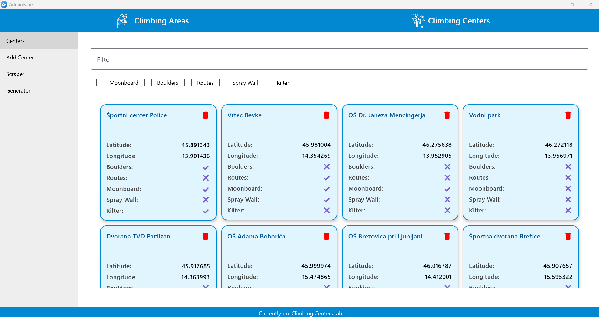

# Projetktne specifikacije

## Cilj namizne aplikacije

* Cilj je razviti namizno aplikacijo, ki administratorjem omogoča: 
    * upravlanje plezališč, plezalnih poti in plezalnih centrov v naši spletni aplikaciji
    * dodajanje le teh s pomočjo spletnega stgalnika (angl. web sraper)
* Podatke smo se odločili strgati iz:
    * Climbing areas and routes: [plezanje.net](https://www.plezanje.net/plezalisca/slovenija)
    * Climbing centes: [ksp.pzs.si](https://ksp.pzs.si/plezalisca.php?tip=3)
* [Stran reposatorija spletne aplikacije](https://github.com/RockSolidProject/WebApp)

### Skupine uporabnikov
* Naši Administratorji, ki želijo upravljati/dodajati podatke v našo spletno aplikacijo

## Opis rešitve

* Projekt je razvit z uporabo Kotlin in CompseMultiplatform.
* Administratorjem omogoča popravlanje podatkov, ki so jih dodali uporabniki in odstranjevanje neprimernih. Omogoča pa tudi dodajanje plezališč in plezalnih centrov, ki še jih nimamo iz prej omenjenih strani z strgačmikom.
* Administratorji to delajo z uporabo namizne aplikacije:

## Ključne funkcionalnosti
Implementirane funkcionalnosti: 
* prikaz plezališč, plezalnih centrov in poti shranjenih v bazi,
* filtriranj prikaza po imenu ali pa različnih podanih filtrih (checkboxi),
* urejanje plezalnih centrov plezališč in njim pripadajočih poti,
* dodajanje poti plezališčem,
* odsranjevanje poti iz plzališč,
* ročno dodajanje plezališč in plezalnih centrov,
* dodajanje plezališč in plezalnih centrov s pomočjo strgalnika,
* generiranje plezališč in plezalnih centrov z generatorjem (naključni podatki),
* urejanje generiranih poatkov pred dodajanjem v bazo.

## Zahteve
### Sistemske zahteve
* Oracle OpenJDK 21.0.3
* Gradle 8.7
* Kotlin 1.9.22
* Groovy: 3.0.17
* Git (V primeri, če želite ta reposatorij dobiti na svojo napravo)
### Strojne zahteve
* Sama plikacija ne potrebuje veliko virov
    * **CPU:** 1 jederni
    * **RAM:** 200 MB
    * **Disk:** 200 MB (V primeru že naloženih sistemskih zahtev in drugih odvisnosti)
* Priporočilo za celetno napravo razvoj, kjer potrebno tudi OS , razvojno okolje in naša spletna aplikacija
    * Windows
        * **CPU:** 4 jederni
        * **RAM:** 8GB
        * **Disk:** 128GB
    * Linux 
        * **CPU:** 2 jederni
        * **RAM:** 4GB
        * **Disk:** 32GB
### Uporabljene knjižnice in okolja (se pridobije same ob uporabi naše gradle datoteke)
* jsoup:1.15.4
* selenium-chrome-driver:4.21.0
* material3-desktop:1.5.10
* mongodb-driver-sync:4.11.0
* json:20231013
* okhttp:4.12.0
